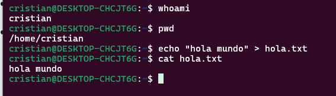
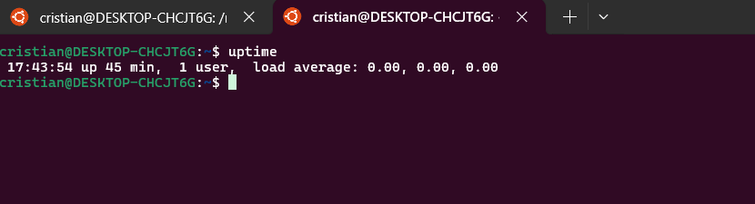

## Reflexión personal

**¿Qué significa DevOps para mí?**  
Una forma de trabajar de tal forma que el flujo de desarrollo
de un proyecto pueda evolucionar constantemente para seguir
innovando.

**¿Qué herramientas ya conocía?**  
Git, Docker, Github y un poco de Bash

**¿Cuáles son nuevas para mí?**  
Terraform y Ansible 

### 📸 Capturas

**Comandos básicos:**

**Resultado del comando `uptime`:**

**Uso de `top`:**

