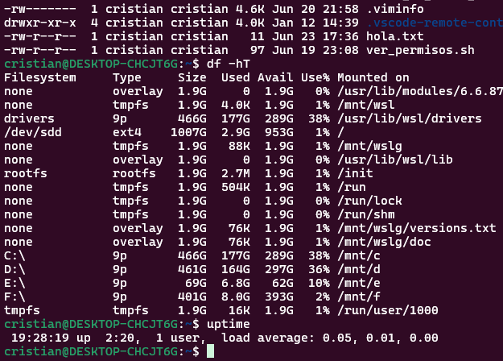
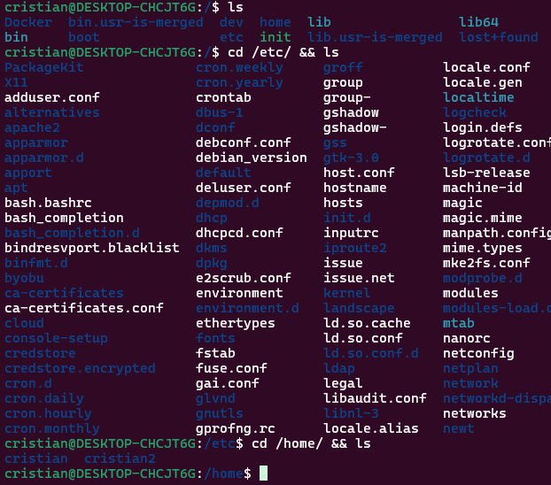
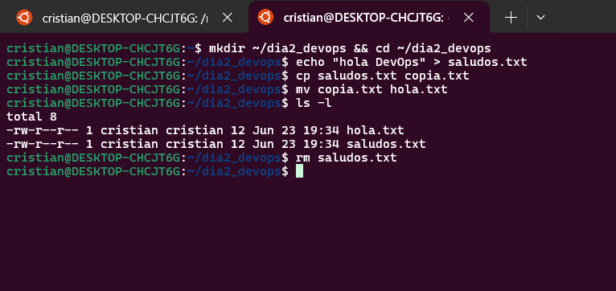
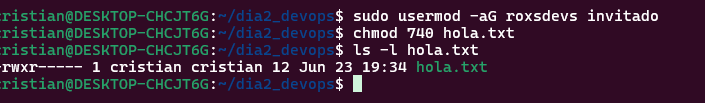
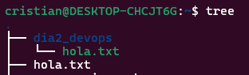

# Día 2 Cristian: Exploración, manipulación de archivos y permisos

## 🛠️ 1. Exploración básica

```bash
whoami        # Muestra el usuario actual
pwd           # Muestra el directorio actual
ls -lah       # Lista archivos con detalles, incluyendo ocultos
df -hT        # Uso de disco y tipo de sistema de archivos
uptime        # Tiempo desde que el sistema está encendido
```

### 🗂️ Navegación por directorios clave

```bash
cd /
ls
cd /etc && ls
cd /home && ls
```

📸 **Capturas sugeridas:**

- 
- 

---

## 📂 2. Crear y manipular archivos

```bash
mkdir ~/dia2-devops && cd ~/dia2-devops
echo "Hola Roxs DevOps!" > saludos.txt
cp saludos.txt copia.txt
mv copia.txt hola.txt
rm saludos.txt
```

📸 **Captura de la carpeta final con `tree`:**

- 

---

## 👥 3. Usuarios y permisos

```bash
sudo adduser invitado
sudo groupadd roxsdevs
sudo usermod -aG roxsdevs invitado

chmod 740 hola.txt
ls -l hola.txt
```

📸 **Permisos del archivo `hola.txt`:**

- 

---

## 🔐 4. Buscar archivos con permisos peligrosos

```bash
find / -type f -perm 0777 2>/dev/null
```

*(Este comando busca archivos con permisos 777 —riesgo de seguridad—)*

---

## 🧠 5. Reto de comprensión

```bash
chmod u=rwx,g=rx,o= hola.txt
```

**Explicación:**  
Este comando asigna permisos:
- `u=rwx`: el usuario dueño puede leer, escribir y ejecutar
- `g=rx`: el grupo puede leer y ejecutar
- `o=`: otros no tienen ningún permiso

---

## 📸 6. Bonus

```bash
tree ~/dia2-devops
```

📸 **Captura con estructura de archivos creada:**

- 
