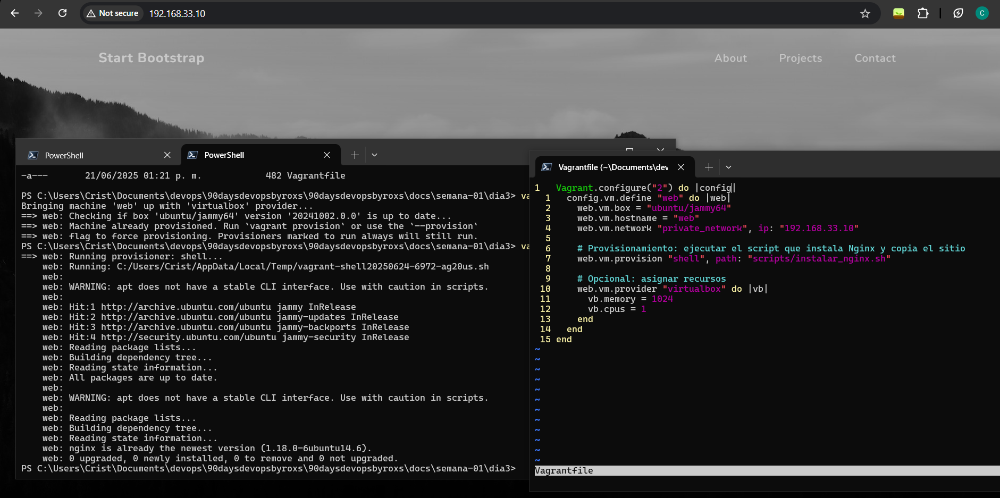

# 🌐 Día 3 Cristian: Vagrant + Nginx + Sitio Web Personalizado

## 📦 Descripción

En este día creamos una máquina virtual con **Vagrant** y **Nginx** instalado, sirviendo un sitio web personalizado desde una carpeta sincronizada. Aprendimos a automatizar la creación de entornos reproducibles con scripts y a visualizar los resultados en un navegador.

---

## ⚙️ Configuración de la VM

- **Box**: `ubuntu/jammy64`
- **IP privada**: `http://192.168.33.10`
- **Provisionamiento**: script `instalar_nginx.sh`
- **Sitio web**: contenido HTML ubicado en la carpeta local `site/`, sincronizada con `/vagrant/site` en la VM.

---

## 🗂️ Estructura del Proyecto

```
dia3/
├── Vagrantfile
├── scripts/
│   └── instalar_nginx.sh
├── site/
│   ├── index.html
│   └── assets/
└── captura-pagina.png
```


## 🌐 Visualización del Sitio

Una vez levantada la VM con `vagrant up`, puedes acceder al sitio desde tu navegador en la dirección:

👉 [http://192.168.33.10](http://192.168.33.10)

---

## 🖼️ Captura de Pantalla

Asegúrate de tener una imagen llamada `captura-pagina.png` en la misma carpeta que este documento. La siguiente línea mostrará la imagen si estás viendo este archivo desde un visor compatible (por ejemplo, Docusaurus o VSCode con extensión de Markdown):



---
